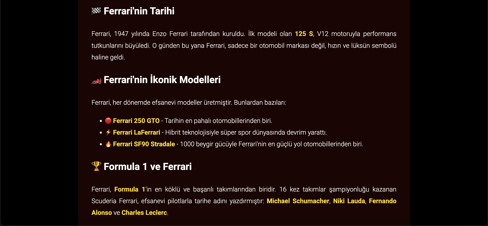

# kodluyoruzilkrepo
Kodluyoruz Eğitimi kapsamında açtığım ilk repo





## Installation
Öncelikle projeyi clonelayın. (Buraya sizin reponuzdan aldığınız link gelecek)

```
git clone https://github.com/irmylmz/kodluyoruzilkrepo.git
```


## Usage
Projeyi cloneladıktan sonra Visual Studio Code programında açınız.

Linux veya MacOs için:
```
cd kodluyoruzilkrepo
code .
```

## License
[MIT](https://choosealicense.com/licenses/mit/)